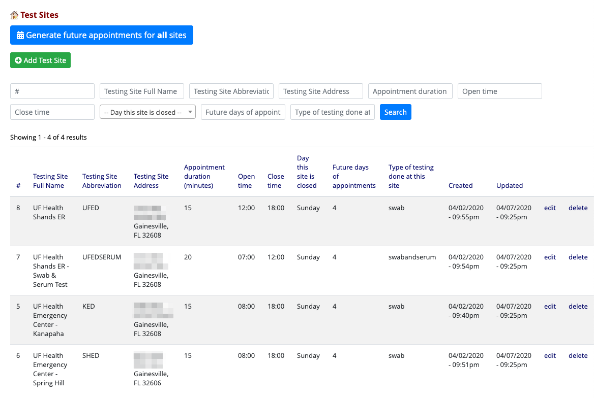

# REDCap First Responder COVID-19

[](https://doi.org/10.5281/zenodo.3745255)

A REDCap module to facilitate the scheduling and data management of COVID-19 testing for first responders. This project was created by a multidisciplinary team at the University of Florida to support the testing of first responders in Alachua County, Florida and the surrounding counties.


## Caution
This module was created with numerous abstractions to allow it to be reused in other sites and projects, yet there remain some hard-coded project features. We advise you to use the included Project XML as a starting point to minimize your challenges in running this module. Also, be aware the data entry fields for site data do not carefully test the values keyed in. We recommend you start with the included example sites file, then make modifications.

## Prerequisites
- REDCap >= 9.3.5
- [REDCap Entity](https://github.com/ctsit/redcap_entity) >= 2.3.3

## Manual Installation
- Clone this repo into `<redcap-root>/modules/fr_covidata_v0.0.0`.
- Clone the [redcap_entity](https://github.com/ctsit/redcap_entity) repo into `<redcap-root>/modules/redcap_entity_v0.0.0`.
- Go to **Control Center > External Modules**, enable REDCap Entity, and then this module. REDCap Entity will be enabled globally, but `fr_covidata` has to be enabled on a per-project basis after *Global Configuration* is completed.

## Configuration

To configure and use this module, follow these steps:

1. Create a REDCap project from the file [`First_Responder_COVID19.xml`](example/First_Responder_COVID19.xml)
1. Update the `appointments` field on the `Appointments Form`, changing it to a Dynamic SQL field and configuring it to auto-complete. Paste the appropriate code from [`example/dynamic_sql_query_for_appointment.sql`](example/dynamic_sql_query_for_appointment.sql)
1. Enable the FR Covidata module as described above.
1. Configure the FR Covidata module identify to set `Which location ID is this project for? (0-15)`. This will reduce the risk of errors if one lab is processing specimens from different REDCap projects. Start with 0 and work your way up if you have to deploy multiple production instances of this module.
1. Configure the FR Covidata module identify to set `Which instrument is used for appointments?` In the included REDCap XML files, the form is named "Appointments".
1. Configure the FR Covidata module to indicate which repeat type is used for repeats: _Repeating instances_ or _Individual Events_. In the included REDCap XML files, _events_ are used.

1. Use a MySQL client to load sites data from [`redcap_entity_test_site_data.sql`](example/redcap_entity_test_site_data.sql). Alternatively, use the `Define Sites` page of this module to enter the data. Be cautious as some portions of the interface of this module have very few guard rails. I.e., your data entry will not be checked. Time did not allow the addition of these tests, nor does it allow for much documentation. As such, the authors advise you to _use the example configuration_ as a starting point.
1. Adjust the project_ids referenced on those just-loaded sites by editing and running a copy of [`redcap_entity_test_site_update.sql`](example/redcap_entity_test_site_update.sql)
1. Access `Define Sites` to make any needed changes to the site definitions.
1. Generate the initial appointment blocks by accessing `Define Sites` and clicking `Generate future appointments for all sites`



## Appointment Scheduling Features

This module adds an appointment scheduling feature to REDCap. This feature is built on top of REDCap Entity and a dynamic SQL field. It allows appointment blocks to be selected from a Dynamic SQL field using the built-in auto-completion feature of Dynamic SQL fields. The SQL query queries a table of appointments to generate a list of available appointment blocks. On form save, REDCap writes the `appointment_id` into the value of the Dynamic SQL field. The module uses the `redcap_save_record` hook to write the `record_id` and `event_id` into the appointment record. The `redcap_save_record` hook will also update appointment-related fields on the record to provide easy lookups of the site details and date and time of the appointment block.

Once assigned to a person, an appointment block is no longer available. This feature is used in a REDCap survey to allow the first responders to select their appointments.

If the research participant needs to cancel or change an appointment, they must call the Study Team. The study team will access the REDCap project, locate the participant's record, and cancel or replace the existing appointment.

REDCap Entity manages the table of appointments. 


## Site Management Features

A _site_ is a COVID-19 testing site. A study coordinator or REDCap admin must define each site before appointment blocks for that site can be created. 

REDCap Entity manages the site data. A study coordinator or REDCap admin can populate the site table by accessing the Define Sites page. It allows for CRUD operations on sites for this project.

Each site allows the configuration of a long name, short name, appointment duration, address, open time, close time, closed days of the week, and the number of appointment days to build out in advance. The open and close times are bounds on the generation of appointments.


## Appointment Block Management Features

An _appointment block_ is a fixed block of time at a single site. Appointment blocks must be created for a site before a research participant can schedule an appointment at that site.

This module manages appointment block creation. The script that makes the appointment blocks can be run manually or automatically. The appointment blocks are generated when a study coordinator presses the `Generate future appointments for all sites` button of the Define sites page or automatically by a cron job that runs each day.

Appointment block creation uses the _appointment horizon_, _site id_, _open_, _close_, _closed_days_, and _appointment duration_ attributes for each site to generate records in the appointments table. It will create _appointment horizon_ days of appointment blocks for each site if those blocks do not already exist.

The module will define a cron job that runs daily to assure _appointment horizon_ days of appointment blocks exist at all times. Whether you let the cron job make the appointments or click the `Generate future appointments for all sites` button to make them, the underlying code will create appointment blocks starting on the _next day_. For example, if you configure a site to have three days of appointments, then click the button on Monday, the script will create appointments on Tuesday, Wednesday, and Thursday. If the same site were closed on Wednesday, the script would create appointments only on Tuesday and Thursday. 

Note: If you want to change the time at which the cron job runs, you will need to edit the timestamps in this module's most recent record in the table `redcap_crons_history`. 


## Using test data

The [`test_data`](./test_data/) folder includes RScript to generate test datasets for the ICF, Questionnaire and Mini Questionnaire. Together, these import files can speed the process of testing the custom code used in these project. To make test data. Open the R Project in the [`test_data`](./test_data/) folder and run `make_test_data.R`. If you provide a file called `replacement_demographics.csv` and it has the columns first_name, last_name, email, and phone1 the RScript will replace the first_name, email, and phone on each demographic record. 

To load test data, erase all data in the project, then load these three files from [`./test_data/output/`](./test_data/output/):

```
all_baseline_data.csv
```

There are additional `mini_questionnaire_0*` files, but they might not be useful for typical testing. They fill in the mini-question with diminishing frequency, but they do it out of sync with the Appointment and Result forms. That is probably not helpful, but they are provided here should they prove useful.


## Clone a project into Production

To clone a development project into a production project, follow the steps below. Note: This procedure assumes you are copying a project within a REDCap host.

1. Locate your development project and copy it using `Project Setup`, `Other Functionality`, `Copy the project`.
1. Set the details on the new project 'First Responder COVID-19 Testing - Production'.
1. Also copy the following project attributes:
    - [ ] All records/responses (NNN records total)
    - [x] All users and user rights
    - [x] All users roles
    - [x] All reports
    - [x] All report folders
    - [x] All data quality rules
    - [x] All Project Folders
    - [x] All settings for Survey Queue and Automated Survey Invitations
    - [x] All project bookmarks
    - [x] All custom record status dashboards
    - [x] All settings for External Modules (modules will be disabled by default)
    - [x] All alerts & notifications
1. Enable Project Overlay Banner module.  Set text to
`This is the real, production project. It is under construction and not ready for live data`. Set the CSS to something like this to change the BG color to yellow

    ```
    #project-overlay-banner {
        /* position and z-index cause the banner to appear to float over the page */
        position: fixed;
        z-index: 1000;
    
        opacity: 0.8;
    
        --bg-color: #008888;
        background-color: var(--bg-color);
    
        padding: 1%;
    
        width: 100%;
    
        text-align: center;
    }
    ```
1. Enable the FR Covidata module.
1. Configure the FR Covidata module identify to set `Which location ID is this project for? (0-15)`. Change this to _not_ match the location in the development project.
1. Configure the FR Covidata module identify to set `Which instrument is used for appointments?` In the included REDCap XML files, the form is named "Appointments".
1. Configure the FR Covidata module to indicate which repeat type is used for repeats: _Repeating instances_ or _Individual Events_. In the included REDCap XML files, _events_ are used.
1. Use a MySQL client to load the site data from [`redcap_entity_test_site_data.sql`](example/redcap_entity_test_site_data.sql).
1. Adjust the project_ids referenced on those just-loaded sites by editing and running a copy of [`redcap_entity_test_site_update.sql`](example/redcap_entity_test_site_update.sql)
1. Access `Define Sites` to make any needed changes to the site definitions.
1. Generate the initial appointment blocks by accessing `Define Sites` and clicking `Generate future appointments for all sites`.
1. Add an API token for the data manager and send the token to be integrated into Rscript-based tools that need it.
1. Assign User Rights privileges to the Study team lead so they can make roles and adjust user rights for their team.
1. Delete reports that are only relevant in the development.
1. Edit Alerts to remove testing email addresses in the To: field, set From addresses to something reasonable, "TEST" banner at the top of the emails, and "TESTING:" from the subject lines.
1. Switch the project to production mode.
1. Disable the Project Overlay Banner module.
1. Add the Public Survey URL to the public-facing landing page.
1. You have now completed the project deployment.

